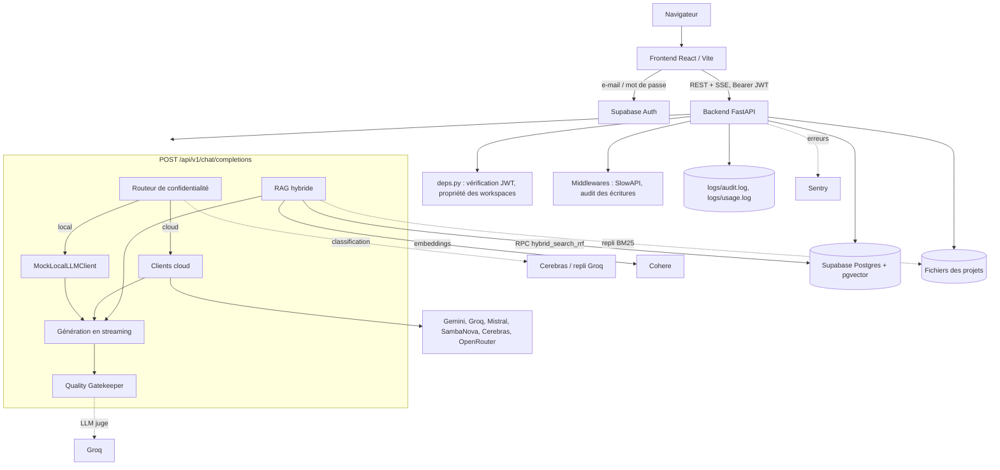
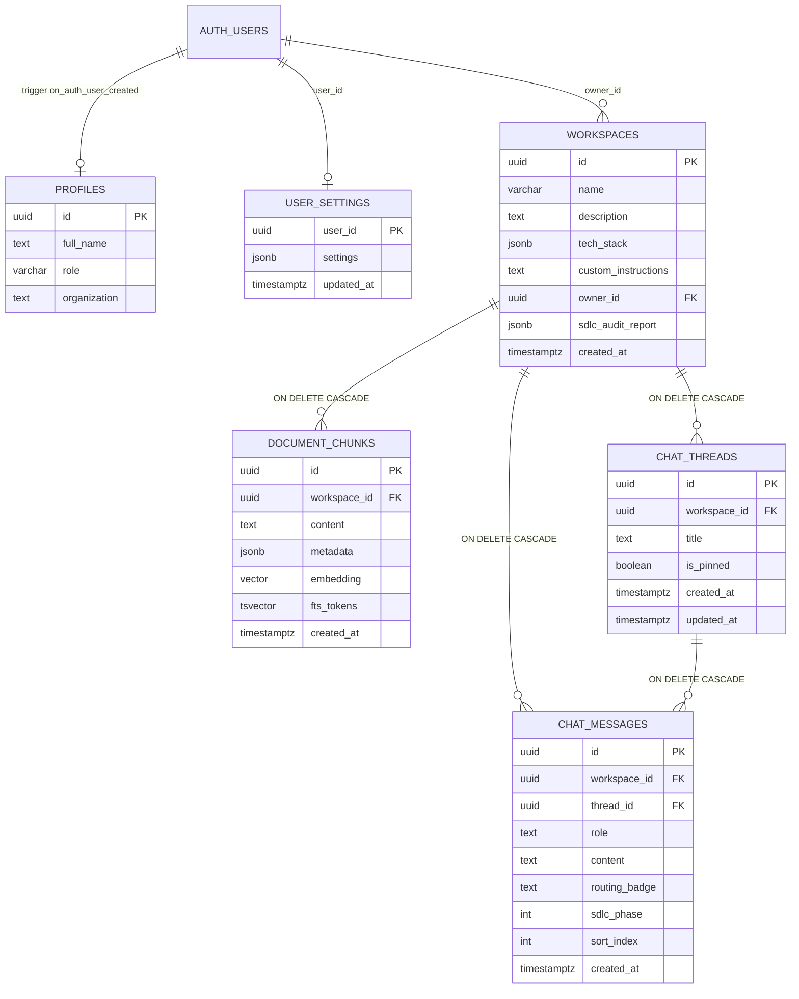

# Fuzyo Copilot

Assistant IA souverain qui accompagne une équipe logicielle sur les **9 phases du cycle de vie du développement (SDLC)**, de l'expression du besoin à la mise en production. Chaque requête passe par un routeur de confidentialité (exécution locale ou cloud), un RAG sur la base documentaire du projet et un contrôle qualité en 3 niveaux, avec des réponses diffusées en temps réel via Server-Sent Events.

[](https://github.com/MustaphaBC/fuzyo-copilot/actions/workflows/ci.yml)


> Licence : aucune licence n'est présente dans le repository (voir [Licence](#-licence)).
> Version : non définie (`frontend/package.json` indique `0.0.0`, le backend n'a pas de numéro de version).

---

## 📋 Table des matières

- [Présentation](#-présentation)
- [Fonctionnalités](#-fonctionnalités)
- [Technologies utilisées](#️-technologies-utilisées)
- [Structure du projet](#-structure-du-projet)
- [Prérequis](#️-prérequis)
- [Installation](#-installation)
- [Configuration](#-configuration)
- [Utilisation](#️-utilisation)
- [Tests](#-tests)
- [Architecture](#️-architecture)
- [Fonctionnement du projet](#-fonctionnement-du-projet)
- [API](#-api)
- [Base de données](#️-base-de-données)
- [Sécurité](#-sécurité)
- [Docker](#-docker)
- [Déploiement](#-déploiement)
- [Dépannage](#-dépannage)
- [Scripts disponibles](#-scripts-disponibles)
- [Contribution](#-contribution)
- [Convention Git](#-convention-git)
- [Roadmap](#-roadmap)
- [FAQ](#-faq)
- [Licence](#-licence)
- [Auteurs / Mainteneurs](#-auteurs--mainteneurs)
- [Support](#-support)
- [Ressources](#-ressources)
- [Notes importantes](#-notes-importantes)

---

## 📖 Présentation

### Le problème

Les équipes logicielles utilisent des assistants IA généralistes qui :

- ne connaissent ni le projet, ni sa stack, ni ses documents ;
- n'adaptent pas leurs réponses à l'étape du cycle de vie (un cahier des charges ne se rédige pas comme un pipeline CI/CD) ;
- envoient tout au cloud, y compris des secrets (clés API, mots de passe, IP internes) ;
- livrent parfois du code incomplet (`TODO`, fonctions vides, blocs tronqués).

### La solution

Fuzyo Copilot (décrit dans `docs/CDC.md` comme « Fuzyo SDLC AI Assistant ») est une application web full-stack qui :

1. **Structure le travail en 9 phases SDLC**, chacune avec son prompt système, son modèle LLM par défaut et ses livrables attendus.
2. **Protège les données** : un routeur de confidentialité détecte les secrets et évalue la sensibilité du prompt ; en cas de doute, la requête reste locale (*fail-closed*).
3. **Contextualise les réponses** grâce à un RAG hybride (vecteurs + plein texte) sur les documents et le code du projet.
4. **Contrôle la qualité** de chaque réponse (schéma, heuristiques, LLM juge) et relance automatiquement la génération si nécessaire.
5. **Matérialise les livrables** dans une arborescence de projet locale, téléchargeable en DOCX, PDF, Markdown ou ZIP.

### Utilisateurs concernés

Les rôles applicatifs définis dans `backend/app/core/rbac.py` : `developer`, `tech_lead`, `product_owner` et `admin`. Le CDC cite plus largement Product Owners, Architectes, Développeurs, QA et DevOps.

### Cas d'utilisation principaux

- Rédiger un cahier des charges, une SFD ou un DAT à partir de la documentation importée d'un projet.
- Générer du code ou des tests, les relire dans un diff, puis les écrire dans le projet local.
- Poser une question contenant des informations sensibles sans qu'elles quittent la machine.
- Faire valider une phase par un client (recette) et produire un PV de recette (PVR) signé par empreinte SHA-256.
- Suivre l'avancement SDLC d'un projet via un tableau de bord.

---

## ✨ Fonctionnalités

### Assistant conversationnel SDLC

- **Chat en streaming SSE** (`POST /api/v1/chat/completions`) avec événements `routing`, `rag`, `skill`, `token`, `fallback`, `retry`, `quality`.
- **9 phases SDLC** avec prompts « élite » à 5 composants (`[RÔLE]`, `[CONTEXTE]`, `[OBJECTIF]`, `[CONTRAINTES]`, `[FORMAT DE SORTIE]`), générés par `backend/app/prompts/sdlc_prompts.py` à partir du catalogue `sdlc_catalog.py`.
- **Skills slash** : modes `plan`, `analyze`, `review`, `debug` qui ajoutent des consignes spécifiques au prompt système et orientent la requête RAG.
- **Historique multi-tours** : fils de discussion (threads) persistés par projet, avec une fenêtre d'historique configurable (0 à 10 messages, 6 par défaut).
- **Choix manuel du modèle** : la liste des modèles disponibles n'affiche que les fournisseurs dont la clé API est configurée.

### Confidentialité

- **Mode confidentiel forcé** (`force_confidential`) : la requête est traitée par le client local `MockLocalLLMClient`, sans appel réseau.
- **Détection de secrets par regex** : clés `sk-…`, tokens GitHub, clés AWS `AKIA…`, adresses IP, affectations de mot de passe, clés privées SSH, en-têtes `Bearer`.
- **Classifieur de sensibilité** (Cerebras, repli Groq) : au-dessus d'un score de 0,7, la requête reste locale.
- **Fail-closed** : si le classifieur est indisponible (pas de clé, timeout, erreur), la requête est traitée localement.

### Fiabilité

- **Basculement entre fournisseurs** : si un fournisseur cloud échoue, les suivants sont essayés dans l'ordre `LLM_FALLBACK_ORDER`, puis le client local en dernier recours. Les fournisseurs en échec sont mis en pause (*circuit breaker*).
- **Quality Gatekeeper en 3 niveaux** : jusqu'à 3 tentatives de génération si la réponse est invalide ou notée < 7/10.
- **RAG dégradé** : si la recherche vectorielle échoue ou dépasse 2 s, un index BM25 local sur les fichiers du projet prend le relais.
- **Rate limiting** : 20 requêtes/minute sur le chat, réponse JSON 429 avec en-tête `Retry-After`.

### Projets (workspaces)

- Création de projet avec stack technique, instructions personnalisées et chemin hôte optionnel.
- **Import de documents ou de code** (fichiers ou archive ZIP), en synchrone ou en tâche de fond avec suivi de progression.
- **Base de connaissances** : liste et suppression des documents indexés.
- **IDE intégré** : explorateur de fichiers, éditeur Monaco, revue de diff et application des modifications générées.
- **Tableau de bord** : complétion des phases SDLC, couverture documentaire, score de testabilité, stack détectée.
- **Export des livrables** par phase : `docx`, `pdf`, `md`, `zip` ou `raw`.
- **Recette (UAT)** : signature d'une phase et génération d'un PVR PDF horodaté avec empreinte SHA-256.

### Interface

- Rendu Markdown (GFM) et diagrammes **Mermaid**, panneau Canvas pour les artefacts, inspecteur de routage.
- Palette de commandes, raccourcis clavier, thème clair/sombre/système, préférences synchronisées côté serveur.
- **Console d'administration** (rôle `admin`) : utilisateurs, journal d'audit, état des fournisseurs IA, métriques d'usage et de coût.

---

## 🛠️ Technologies utilisées

### Backend (`backend/requirements.txt`)

| Technologie | Utilisation |
| --- | --- |
| Python 3.12 | Langage du backend (version utilisée par la CI et le Dockerfile) |
| FastAPI + Uvicorn | API REST et streaming SSE |
| Pydantic / pydantic-settings | Validation des schémas et chargement de la configuration depuis `backend/.env` |
| httpx | Appels HTTP asynchrones vers les fournisseurs LLM |
| supabase (client Python) | Accès à la base Postgres et à Supabase Auth |
| PyJWT + cryptography | Vérification des JWT Supabase (JWKS RS256/ES256, repli HS256) |
| flashrank | Re-ranking local des résultats RAG |
| rank-bm25 | Recherche plein texte locale de secours |
| pypdf, python-docx, openpyxl | Lecture des documents importés (PDF, DOCX, XLSX) |
| markdown, WeasyPrint, xhtml2pdf | Génération des livrables PDF (xhtml2pdf en repli si WeasyPrint est indisponible) |
| python-multipart | Upload de fichiers |
| slowapi | Rate limiting |
| structlog | Logs structurés |
| sentry-sdk[fastapi] | Suivi des erreurs (optionnel) |
| pytest, pytest-cov | Tests (installés à part, voir [Tests](#-tests)) |

### Frontend (`frontend/package.json`)

| Technologie | Utilisation |
| --- | --- |
| React 19 + React DOM | Interface utilisateur |
| Vite 6 | Serveur de développement et build |
| React Router DOM 7 | Routage côté client |
| Tailwind CSS 3, PostCSS, Autoprefixer | Styles |
| @supabase/supabase-js | Authentification e-mail / mot de passe |
| @monaco-editor/react | Éditeur de code de l'IDE intégré |
| mermaid | Rendu des diagrammes |
| react-markdown + remark-gfm | Rendu Markdown des réponses |
| jszip | Manipulation d'archives ZIP côté client |
| lucide-react | Icônes |
| ESLint 9 | Analyse statique |
| Playwright | Tests end-to-end |

### Services externes

| Service | Utilisation dans le code |
| --- | --- |
| Supabase | Postgres + `pgvector` + `pg_trgm`, Auth (JWT) |
| Google Gemini | Phases 1, 2, 3, 7, 9 (`gemini-3.6-flash`) |
| Groq | Phases 4, 6, 8 (`openai/gpt-oss-120b`), LLM juge, repli du classifieur |
| Mistral | Phase 5 Développement (`codestral-latest`) |
| Cerebras | Classifieur de confidentialité (`qwen-3.8-27b`) |
| SambaNova | Fournisseur de basculement (`Meta-Llama-3.3-70B-Instruct`) |
| OpenRouter | Fournisseur de basculement (`openrouter/auto`) |
| Cohere | Embeddings RAG (`embed-v4.0`, 1536 dimensions) |
| Sentry | Observabilité (optionnel) |

### Infrastructure

| Outil | Utilisation |
| --- | --- |
| Docker (multi-stage) | Images backend (`python:3.12-slim-bookworm`) et frontend (`node:22-alpine` puis `nginx:1.27-alpine`) |
| Docker Compose | Stack locale complète |
| Nginx | Service du build React et proxy `/api` vers le backend |
| GitHub Actions | CI : tests backend, lint + build frontend, E2E, smoke test nocturne |

---

## 📁 Structure du projet

```text
fuzyo-copilot/
├── .github/workflows/ci.yml      # Pipeline CI GitHub Actions
├── .cursor/rules/                # Règles pour l'IDE Cursor (conventions du projet)
├── backend/
│   ├── .env.example              # Modèle de configuration (incomplet, voir Configuration)
│   ├── Dockerfile                # Image API non-root, prête pour WeasyPrint
│   ├── requirements.txt
│   ├── app/
│   │   ├── main.py               # Application FastAPI, middlewares, routeurs, /health
│   │   ├── api/                  # Routes HTTP (chat, workspaces, fs, threads, admin…)
│   │   ├── core/                 # Config, sécurité JWT, RBAC, audit, rate limit, logs, Sentry
│   │   ├── prompts/              # Catalogue SDLC, prompts élite, skills, prompts d'évaluation
│   │   ├── schemas/              # Modèles Pydantic des requêtes/réponses
│   │   └── services/             # Logique métier (routeur, LLM, RAG, gatekeeper, exports…)
│   ├── migrations/               # Scripts SQL Supabase 01 → 07
│   ├── scripts/                  # Scripts de vérification contre un backend lancé
│   └── tests/                    # Tests pytest
├── frontend/
│   ├── Dockerfile                # Build Vite + Nginx
│   ├── nginx.conf                # SPA + proxy /api et /health vers le backend
│   ├── vite.config.js            # Proxy de dev /api et /health → 127.0.0.1:8000
│   ├── playwright.config.js      # Projets E2E chromium, live-demo, todo-sim
│   ├── e2e/                      # Tests Playwright et fixtures
│   └── src/
│       ├── main.jsx, App.jsx     # Point d'entrée et routes
│       ├── components/           # UI (Chat, Workspace, Ide, Admin, Analytics, Artifacts…)
│       ├── context/              # Contextes React (Auth, App, Chat, Workspace, Editor…)
│       ├── hooks/                # Raccourcis, autoscroll, synchro des préférences…
│       ├── lib/                  # Client API, client Supabase, routes, stockage…
│       └── utils/                # Filtre d'ignore, assainissement Mermaid
├── docs/                         # CDC, SFD, DAT, ROADMAP, rapports, présentation
├── docker-compose.yml            # Stack locale backend + frontend
├── pytest.ini                    # Configuration pytest (marqueur live)
└── start.ps1                     # Lancement local backend + frontend sous Windows
```

### Rôle des éléments importants

| Chemin | Rôle |
| --- | --- |
| `backend/app/api/chat.py` | Endpoint SSE : routage, RAG, génération, basculement, contrôle qualité, comptage de tokens |
| `backend/app/api/deps.py` | Authentification (`get_current_user`, `require_admin`), contrôle de propriété des workspaces, caches TTL |
| `backend/app/services/privacy_router.py` | Scan de secrets + classifieur de sensibilité, choix local/cloud et du modèle par phase |
| `backend/app/services/cloud_providers.py` | Clients Groq, Gemini, Cerebras, SambaNova, Mistral (et base OpenAI-compatible) |
| `backend/app/services/local_stub.py` | `MockLocalLLMClient` : réponse locale simulée, sans réseau |
| `backend/app/services/provider_fallback.py` | Ordre de basculement et disjoncteurs par fournisseur |
| `backend/app/services/gatekeeper.py` | Quality Gatekeeper en 3 niveaux |
| `backend/app/services/rag_service.py` | Embeddings Cohere, RPC `hybrid_search_rrf`, re-ranking FlashRank, repli BM25 |
| `backend/app/services/workspace_fs.py` | Provisionnement et écriture sécurisée des projets sur le disque local |
| `backend/app/services/deliverable_exporter.py` | Exports DOCX / PDF / Markdown / ZIP et PVR |
| `backend/app/prompts/sdlc_catalog.py` | Source unique des 9 phases (rôle, objectif, livrables) |
| `frontend/src/lib/api.js` | `apiFetch` : ajoute le JWT, rafraîchit la session une fois en cas de 401 |
| `frontend/src/context/AuthContext.jsx` | Session Supabase et contournement d'authentification pour les tests E2E |
| `docs/` | Documentation projet : `CDC.md`, `SFD.md`, `DAT.md`, `ROADMAP.md`, `Rapport_Fuzyo_Copilot_SDLC.md` |

---

## ⚙️ Prérequis

| Outil | Version | Source |
| --- | --- | --- |
| Python | 3.12 | `.github/workflows/ci.yml`, `backend/Dockerfile` |
| Node.js | 22 | `.github/workflows/ci.yml`, `frontend/Dockerfile` |
| npm | fourni avec Node.js | `frontend/package-lock.json` |
| Git | — | Pour cloner le repository |
| Docker + Docker Compose | — | Optionnel, pour la stack conteneurisée |
| PowerShell | — | Optionnel, pour `start.ps1` (Windows) |

Services externes :

- **Un projet Supabase** (obligatoire pour l'authentification, les projets, l'historique et le RAG), avec les extensions `vector` et `pg_trgm`.
- **Clés API des fournisseurs LLM** : toutes optionnelles individuellement, mais voir l'avertissement ci-dessous.

> [!WARNING]
> Sans clé `CEREBRAS_API_KEY` ni `GROQ_API_KEY`, le classifieur de confidentialité est indisponible et **toutes les requêtes sont traitées par le client local simulé** (réponse `[LOCAL MOCK EXECUTION]`). C'est le comportement *fail-closed* voulu.

> [!NOTE]
> Sous Windows, WeasyPrint nécessite des bibliothèques GTK. S'il n'est pas utilisable, le backend bascule automatiquement sur `xhtml2pdf` pour générer les PDF.

---

## 🚀 Installation

### 1. Cloner le repository

```bash
git clone https://github.com/MustaphaBC/fuzyo-copilot.git
cd fuzyo-copilot
```

### 2. Préparer la base Supabase

Dans le **SQL Editor** de votre projet Supabase, exécutez les migrations **dans l'ordre** :

```text
backend/migrations/01_init_schema.sql
backend/migrations/02_chat_messages.sql
backend/migrations/03_chat_threads.sql
backend/migrations/04_workspace_owner.sql
backend/migrations/05_thread_pins.sql
backend/migrations/06_enterprise_features.sql
backend/migrations/07_user_settings.sql
```

Le détail de chaque migration est donné dans la section [Base de données](#️-base-de-données).

### 3. Installer le backend

Les imports Python sont de la forme `backend.app…` : les commandes se lancent **depuis la racine du repository**.

```bash
python -m venv .venv

# Linux / macOS
source .venv/bin/activate
# Windows (PowerShell)
.\.venv\Scripts\Activate.ps1

pip install -r backend/requirements.txt
```

### 4. Configurer le backend

```bash
# Linux / macOS
cp backend/.env.example backend/.env
# Windows (PowerShell)
Copy-Item backend/.env.example backend/.env
```

Complétez ensuite `backend/.env` (voir [Configuration](#-configuration)). Le fichier d'exemple ne contient pas toutes les variables utiles : ajoutez au minimum `SUPABASE_JWT_SECRET` et les clés des fournisseurs que vous utilisez.

### 5. Installer le frontend

```bash
cd frontend
npm install
```

Créez `frontend/.env` avec les variables Supabase publiques :

```dotenv
VITE_SUPABASE_URL=https://<votre-projet>.supabase.co
VITE_SUPABASE_ANON_KEY=<clé anon publique>
```

### 6. Lancer l'application

Voir [Utilisation](#️-utilisation). Une fois lancée, l'interface est sur `http://127.0.0.1:5173/` et l'API sur `http://127.0.0.1:8000/`.

---

## 🔧 Configuration

### Backend : `backend/.env`

La configuration est chargée par `backend/app/core/config.py` (pydantic-settings) depuis `backend/.env` ou depuis les variables d'environnement. Les noms ne sont pas sensibles à la casse.

#### Supabase

| Variable | Description | Obligatoire | Exemple |
| --- | --- | --- | --- |
| `SUPABASE_URL` | URL du projet Supabase | Oui | `https://xxxx.supabase.co` |
| `SUPABASE_SECRET_KEY` | Clé secrète (service role) utilisée par le backend | Oui | `À compléter` |
| `SUPABASE_JWT_SECRET` | *JWT Secret* (Project Settings → API) pour vérifier les tokens HS256 | Recommandé | `À compléter` |

Sans `SUPABASE_URL` ou `SUPABASE_SECRET_KEY`, les routes qui touchent la base répondent `503 Supabase not configured`.

#### Fournisseurs LLM et embeddings

| Variable | Description | Obligatoire | Exemple |
| --- | --- | --- | --- |
| `GEMINI_API_KEY` | Google Gemini (phases 1, 2, 3, 7, 9) | Non | `À compléter` |
| `GROQ_API_KEY` | Groq (phases 4, 6, 8, LLM juge, repli du classifieur) | Non | `À compléter` |
| `MISTRAL_API_KEY` | Mistral Codestral (phase 5) | Non | `À compléter` |
| `CEREBRAS_API_KEY` | Classifieur de confidentialité | Non | `À compléter` |
| `SAMBANOVA_API_KEY` | Fournisseur de basculement | Non | `À compléter` |
| `OPENROUTER_API_KEY` | Fournisseur de basculement | Non | `À compléter` |
| `COHERE_API_KEY` | Embeddings RAG | Non | `À compléter` |

#### Routage, confidentialité et basculement

| Variable | Description | Obligatoire | Défaut |
| --- | --- | --- | --- |
| `FORCE_LOCAL_MOCK` | Force toutes les requêtes vers le client local | Non | `false` |
| `PRIVACY_CLASSIFIER_TIMEOUT_S` | Délai max de la classification ; au-delà, traitement local | Non | `2.5` |
| `PRIVACY_CLASSIFIER_CEREBRAS_MODEL` | Modèle Cerebras du classifieur | Non | `qwen-3.8-27b` |
| `PRIVACY_CLASSIFIER_FALLBACK_PROVIDER` | Repli du classifieur (`groq` ou vide pour désactiver) | Non | `groq` |
| `PRIVACY_CLASSIFIER_GROQ_MODEL` | Modèle Groq du repli | Non | `openai/gpt-oss-20b` |
| `PRIVACY_CLASSIFIER_CIRCUIT_S` | Pause (s) d'un classifieur après un 401/402/403/404 | Non | `300.0` |
| `LLM_FALLBACK_ORDER` | Ordre de basculement des fournisseurs cloud | Non | `groq,gemini,mistral,sambanova,cerebras,openrouter` |
| `LLM_PROVIDER_ACCOUNT_COOLDOWN_S` | Pause après une erreur de compte (401/402/403/404) | Non | `300.0` |
| `LLM_PROVIDER_TRANSIENT_COOLDOWN_S` | Pause après une erreur transitoire (429/5xx/réseau) | Non | `30.0` |

#### Authentification, stockage et observabilité

| Variable | Description | Obligatoire | Défaut |
| --- | --- | --- | --- |
| `AUTH_CACHE_TTL_SECONDS` | Durée du cache des tokens et propriétés de workspace (`0` désactive) | Non | `20.0` |
| `AUTH_CACHE_MAX_ENTRIES` | Taille max de chaque cache | Non | `4096` |
| `LOCAL_WORKSPACE_STORAGE_PATH` | Dossier des projets sur le disque | Non | `<repo>/workspace_projects` |
| `AUDIT_LOG_PATH` | Fichier du journal d'audit | Non | `<repo>/logs/audit.log` |
| `USAGE_LOG_PATH` | Fichier du journal d'usage (tokens, coûts) | Non | `<repo>/logs/usage.log` |
| `SENTRY_DSN` | DSN Sentry (vide = désactivé) | Non | vide |
| `SENTRY_ENVIRONMENT` | Environnement Sentry | Non | `development` |
| `SENTRY_TRACES_SAMPLE_RATE` | Taux d'échantillonnage des traces | Non | `0.0` |

### Frontend : `frontend/.env`

Aucun fichier d'exemple n'existe pour le frontend. Les variables lues par le code sont :

| Variable | Description | Obligatoire | Exemple |
| --- | --- | --- | --- |
| `VITE_SUPABASE_URL` | URL du projet Supabase | Oui | `https://xxxx.supabase.co` |
| `VITE_SUPABASE_ANON_KEY` | Clé publique *anon* Supabase | Oui | `À compléter` |
| `VITE_E2E_AUTH_BYPASS` | `true` contourne l'authentification. **Réservé aux tests E2E** | Non | non défini |

> [!CAUTION]
> Les variables `VITE_*` sont intégrées au bundle JavaScript et donc visibles par tous. N'y mettez jamais la clé secrète Supabase ni une clé de fournisseur LLM.

### Docker Compose

`docker-compose.yml` lit les secrets backend depuis `backend/.env` au démarrage, et les variables de build `VITE_SUPABASE_URL` / `VITE_SUPABASE_ANON_KEY` depuis un `.env` à la racine (chargé automatiquement par Compose) ou depuis l'environnement du shell.

### Rôle administrateur

L'accès à la console d'administration exige `role: "admin"` dans les **`app_metadata`** de l'utilisateur Supabase (modifiable uniquement côté serveur). Le rôle choisi à l'inscription est stocké dans les `user_metadata` et ne donne **pas** les droits d'administration de la plateforme.

---

## ▶️ Utilisation

### Option 1 : script Windows (recommandé sous Windows)

```powershell
.\start.ps1
# ou, si la politique d'exécution bloque les scripts :
powershell -ExecutionPolicy Bypass -File .\start.ps1
```

Le script :

1. vérifie la présence de Python et Node.js ;
2. avertit si `backend\.env` ou `frontend\.env` manque ;
3. lance `npm install` si `frontend\node_modules` n'existe pas ;
4. libère les ports 8000 et 5173 s'ils sont occupés ;
5. ouvre deux fenêtres PowerShell : le backend (`uvicorn --reload`) et le frontend (Vite) ;
6. attend jusqu'à 90 s que `/health` et l'interface répondent, puis ouvre le navigateur.

### Option 2 : lancement manuel

**Backend** (depuis la racine du repository) :

```bash
# Linux / macOS
PYTHONPATH=. python -m uvicorn backend.app.main:app --host 127.0.0.1 --port 8000 --reload
```

```powershell
# Windows (PowerShell)
$env:PYTHONPATH = (Get-Location).Path
python -m uvicorn backend.app.main:app --host 127.0.0.1 --port 8000 --reload
```

**Frontend** (dans un second terminal) :

```bash
cd frontend
npm run dev
```

Vite relaie automatiquement `/api` et `/health` vers `http://127.0.0.1:8000` (voir `frontend/vite.config.js`).

### Option 3 : Docker Compose

```bash
docker compose up --build
```

Interface disponible sur `http://localhost:8080` (voir [Docker](#-docker)).

### URLs utiles

| URL | Description |
| --- | --- |
| `http://127.0.0.1:5173/` | Interface (mode développement) |
| `http://127.0.0.1:8000/health` | Santé de l'API, renvoie `{"status": "ok"}` |
| `http://127.0.0.1:8000/docs` | Documentation Swagger générée par FastAPI |

### Pages de l'interface

| Route | Page |
| --- | --- |
| `/chat`, `/chat/:threadId` | Assistant conversationnel |
| `/projects` | Liste des projets |
| `/projects/:workspaceId/:tab` | Espace projet, onglets `overview`, `instructions`, `sdlc`, `files`, `knowledge`, `changes` |
| `/artifacts` | Navigateur d'artefacts |
| `/settings` | Préférences utilisateur |
| `/admin/:section` | Console d'administration (`users` par défaut) |

---

## 🧪 Tests

### Backend : pytest

Les tests se trouvent dans `backend/tests/`. `pytest.ini` déclare ce dossier comme `testpaths` et définit le marqueur `live`.

```bash
# Depuis la racine du repository
pip install pytest pytest-cov

# Tous les tests (Linux / macOS)
PYTHONPATH=. pytest backend/tests -q

# Avec couverture, comme en CI
PYTHONPATH=. pytest backend/tests -q --cov=backend/app --cov-report=term-missing

# Un fichier ou un test précis
PYTHONPATH=. pytest backend/tests/test_privacy_router.py -q
PYTHONPATH=. pytest backend/tests/test_privacy_router.py -k "secret" -q
```

Sous PowerShell, définissez d'abord `$env:PYTHONPATH = (Get-Location).Path`.

Les fixtures de `backend/tests/conftest.py` isolent les journaux d'audit et d'usage dans un dossier temporaire, vident les caches d'authentification et désactivent le repli Groq du classifieur pour éviter les appels réseau réels.

**Smoke test SSE réel** (marqueur `live`, ignoré sauf activation explicite) :

```bash
RUN_LIVE_TESTS=true \
LIVE_API_BASE_URL=http://127.0.0.1:8000 \
LIVE_BEARER_TOKEN=<access token Supabase> \
PYTHONPATH=. pytest -m live -q --tb=short
```

### Frontend : lint et build

```bash
cd frontend
npm run lint
npm run build
```

### Frontend : Playwright (E2E)

```bash
cd frontend
npx playwright install chromium     # première fois uniquement

npm run test:e2e        # projet chromium (tests principaux)
npm run test:e2e:ui     # interface graphique Playwright
npm run test:e2e:demo   # audit de démonstration live (projet live-demo)
npx playwright test --project=todo-sim   # simulation todo-app (navigateur visible)
```

La configuration (`frontend/playwright.config.js`) démarre automatiquement Vite sur `127.0.0.1:5173` en mode `e2e` avec `VITE_E2E_AUTH_BYPASS=true`. Les rapports sont générés dans `frontend/test-results` et `frontend/playwright-report`.

### Scripts de vérification manuelle

Scripts à lancer depuis la racine, contre un backend démarré sur le port 8000 :

| Script | Vérifie |
| --- | --- |
| `python backend/scripts/e2e_verify.py` | Scénarios E2E (définir `FUZYO_BEARER` avec un access token Supabase) |
| `python backend/scripts/verify_chat_history.py` | Cycle PUT → GET → DELETE de l'historique (migration 02) |
| `python backend/scripts/verify_multi_turn.py` | Mémoire multi-tours via le client local (migrations 02 et 03) |
| `python backend/scripts/verify_embed_cache.py` | Le cache d'embeddings évite les appels HTTP répétés |
| `python backend/scripts/verify_openrouter_402.py` | Repli local hors ligne après une erreur OpenRouter 402 |

---

## 🏗️ Architecture

L'application suit une architecture **frontend / backend asynchrone** :

- le **frontend React** gère l'authentification avec Supabase Auth et appelle l'API avec le JWT de l'utilisateur ;
- le **backend FastAPI** vérifie le JWT, contrôle la propriété des ressources, orchestre les appels LLM et diffuse les réponses en SSE ;
- **Supabase** stocke les projets, l'historique, les profils et les fragments de documents vectorisés ;
- le **système de fichiers local** contient l'arborescence de chaque projet (livrables, code, tests) ;
- les **fournisseurs LLM** sont appelés en HTTP, uniquement si le routeur de confidentialité l'autorise.



### Composants principaux

| Composant | Responsabilité |
| --- | --- |
| Routeur de confidentialité | Décide local ou cloud, choisit fournisseur et modèle selon la phase |
| Clients LLM | Interface commune `BaseLLMClient.generate_stream` ; client OpenAI-compatible pour Groq, Cerebras, SambaNova, Mistral, OpenRouter ; client dédié pour Gemini |
| Basculement | `provider_fallback.py` : candidats suivants, disjoncteurs par fournisseur |
| RAG | Embeddings Cohere → RPC `hybrid_search_rrf` (vecteur + plein texte, fusion RRF) → re-ranking FlashRank ; repli BM25 sur les fichiers locaux |
| Gatekeeper | Niveau 1 structure, niveau 2 heuristiques locales, niveau 3 LLM juge Groq |
| Workspace FS | Arborescence par projet, écritures confinées, index `.fuzyo_workspace_index.json` |
| Exporteur | DOCX, PDF, Markdown, ZIP, PVR de recette |
| Journalisation | Logs structlog, audit JSONL des écritures, journal d'usage JSONL (sans contenu de prompt) |

### Modèle par défaut de chaque phase

Défini dans `_PHASE_PROVIDER_MAP` (`backend/app/services/privacy_router.py`) :

| Phase | Fournisseur | Modèle |
| --- | --- | --- |
| 1. Expression du besoin | Gemini | `gemini-3.6-flash` |
| 2. Analyse fonctionnelle | Gemini | `gemini-3.6-flash` |
| 3. Architecture | Gemini | `gemini-3.6-flash` |
| 4. Gestion de projet / PO | Groq | `openai/gpt-oss-120b` |
| 5. Développement | Mistral | `codestral-latest` |
| 6. Tests & QA | Groq | `openai/gpt-oss-120b` |
| 7. Recette | Gemini | `gemini-3.6-flash` |
| 8. DevOps / CI-CD | Groq | `openai/gpt-oss-120b` |
| 9. Mise en production | Gemini | `gemini-3.6-flash` |

L'utilisateur peut imposer un autre fournisseur et modèle (`provider_override` + `model_override`) à condition que le fournisseur soit connu du registre.

### Arborescence d'un projet sur disque

Chaque projet est provisionné dans `LOCAL_WORKSPACE_STORAGE_PATH` (par défaut `workspace_projects/`, ignoré par Git) ou dans un chemin hôte absolu choisi à la création :

```text
<projet>/
├── docs/phase_1_expression_du_besoin/
├── docs/phase_2_analyse_fonctionnelle/
├── docs/phase_3_architecture/
├── docs/phase_4_gestion_de_projet/
├── docs/phase_7_recette/          # PVR et fiches UAT
├── docs/phase_8_devops/
├── docs/phase_9_mise_en_production/
├── src/                           # Phase 5
├── tests/                         # Phase 6
└── .fuzyo/                        # Métadonnées (workspace.json) et backups/
```

---

## 🔄 Fonctionnement du projet

### Envoi d'un message dans le chat

1. **Authentification** : `apiFetch` ajoute `Authorization: Bearer <JWT Supabase>`. En cas de 401, le frontend rafraîchit la session une fois puis réessaie.
2. **Contrôles préalables** : le backend vérifie le JWT, applique la limite de 20 requêtes/minute et, si un `workspace_id` est fourni, vérifie que l'utilisateur en est propriétaire (sinon 404).
3. **Outils réservés aux admins** : si le prompt demande par exemple « deploy to production » ou « purge workspace rag » et que l'utilisateur n'est pas `admin`, un événement `admin_restricted` est renvoyé et aucun modèle n'est appelé.
4. **Routage** (événement `routing`) :
   - `force_confidential` ou `FORCE_LOCAL_MOCK` → local ;
   - secrets détectés par regex → local (le classifieur est annulé avant d'avoir reçu le prompt) ;
   - classifieur indisponible → local ;
   - score de sensibilité > 0,7 → local ;
   - sinon → cloud, avec le modèle de la phase.
5. **Skill** : un mode `plan` / `analyze` / `review` / `debug` est appliqué s'il est demandé ou détecté dans le prompt (événement `skill`).
6. **RAG** (événement `rag`) : si un projet est sélectionné et que la base de connaissances est activée, recherche hybride avec un timeout de 2 s, sinon BM25 local. L'événement indique la source, le nombre de résultats, les fichiers et des extraits.
7. **Prompt système** : construit à partir du catalogue de la phase, du nom du projet, de sa stack et de ses instructions personnalisées. L'historique du thread est ajouté.
8. **Génération** (événements `token`) : en cas d'erreur d'un fournisseur cloud, un événement `fallback` signale le passage au fournisseur suivant ou au client local.
9. **Qualité** (événement `quality`) : si la réponse est invalide ou notée < 7, un événement `retry` est émis et la génération est relancée avec le retour du juge (3 tentatives au total).
10. **Comptabilité** : tokens estimés, coût, latence, raison du routage et score qualité sont ajoutés à `logs/usage.log`, sans le texte du prompt.

**Exemple** : un prompt contenant `password = "hunter22"` en phase 5 produit un événement `routing` avec `target_client: "LOCAL_STUB"`, `route_reason: "secrets_detected"` et `detected_secrets: ["password_assignment"]`. La réponse commence par `[LOCAL MOCK EXECUTION]`.

### Création d'un projet avec import

1. L'utilisateur crée un projet (nom, description, stack, instructions) et joint des fichiers ou une archive ZIP, en mode `docs` ou `codebase`.
2. Le backend insère le workspace dans Supabase et provisionne l'arborescence locale.
3. Les fichiers sont copiés dans un dossier temporaire ; `node_modules`, `.git`, `.venv`, `dist`, `__pycache__` et les fichiers `.env*` sont ignorés.
4. Les documents sont découpés en fragments (800 caractères, chevauchement 100), vectorisés par Cohere et insérés dans `document_chunks`.
5. Un rapport d'audit SDLC (`sdlc_audit_report`) est calculé et enregistré.
6. Avec `async_ingest=true`, la réponse contient un `job_id` à interroger via `GET /workspaces/{id}/ingest-jobs/{job_id}`.

### Application de code généré

1. L'utilisateur relit le diff dans l'IDE ou l'onglet *Changes*.
2. `POST /workspaces/{id}/apply-changes` écrit les fichiers dans le dossier de la phase (`src/` en phase 5, `tests/` en phase 6) ; les chemins contenant `..` sont refusés.
3. Les fichiers écrits sont réindexés dans le RAG, le rapport d'audit est recalculé et l'opération est consignée dans `logs/audit.log`.

### Recette (UAT)

1. Le validateur signe une phase via `POST /uat/sign-off`.
2. Le backend calcule une empreinte SHA-256 du contenu canonique (projet, phase, livrables, validateur, date, notes, décision).
3. Il écrit le PVR (PDF), la fiche UAT (Markdown) et les métadonnées (JSON) dans `docs/phase_7_recette/`, puis renvoie le PDF.

---

## 🔌 API

Toutes les routes métier sont préfixées par `/api/v1` et exigent `Authorization: Bearer <access token Supabase>`, sauf `/health`. La documentation interactive générée par FastAPI est disponible sur `/docs`.

### Codes HTTP communs

| Code | Signification |
| --- | --- |
| `200` | Succès |
| `400` | Paramètre invalide (phase hors 1–9, format inconnu, chemin interdit, type de fichier refusé…) |
| `401` | Token absent, invalide ou expiré |
| `403` | Rôle administrateur requis |
| `404` | Ressource introuvable, ou workspace n'appartenant pas à l'utilisateur |
| `422` | Corps de requête invalide (validation Pydantic, champs inconnus refusés) |
| `429` | Limite de requêtes dépassée (`Retry-After` dans l'en-tête et le corps) |
| `502` | Échec d'une opération Supabase |
| `503` | Supabase non configuré ou injoignable |

### Santé

```http
GET /health
```

```json
{ "status": "ok" }
```

### Chat

```http
POST /api/v1/chat/completions
Content-Type: application/json
```

Limité à **20 requêtes/minute** par token (ou par IP sans token). Réponse `text/event-stream`.

```json
{
  "prompt": "Rédige le cahier des charges du module de facturation",
  "sdlc_phase": 1,
  "force_confidential": false,
  "skill": "none",
  "workspace_id": "6f1c…",
  "thread_id": "a3b2…",
  "model_override": null,
  "provider_override": null,
  "history_window": 6,
  "use_project_context": true,
  "prefer_project_files": true,
  "use_workspace_knowledge": true
}
```

| Champ | Type | Description |
| --- | --- | --- |
| `prompt` | string, requis | Message de l'utilisateur (non vide) |
| `sdlc_phase` | int 1–9, requis | Phase SDLC |
| `force_confidential` | bool | Force le traitement local |
| `skill` | `none` \| `plan` \| `analyze` \| `review` \| `debug` | Mode skill |
| `workspace_id` | string | Projet (active le RAG et le contexte projet) |
| `thread_id` | string | Thread dont l'historique est injecté (avec `workspace_id`) |
| `provider_override`, `model_override` | string | Fournisseur et modèle imposés |
| `history_window` | int 0–10 | Nombre de messages d'historique |
| `use_project_context` | bool | Injecte les instructions du projet |
| `prefer_project_files` | bool | Demande au modèle de s'appuyer sur les fichiers du projet |
| `use_workspace_knowledge` | bool | Active la recherche RAG |

Exemple de flux :

```text
data: {"type": "routing", "target_client": "CLOUD_API", "selected_provider": "gemini", "selected_model": "gemini-3.6-flash", "sensitivity_score": 0.1, "detected_secrets": [], "requires_rag": true, "route_reason": "cloud_allowed"}

data: {"type": "rag", "status": "ok", "source": "hybrid_supabase", "hit_count": 5, "query": "…", "reranker": "flashrank", "files": ["…"], "snippets": ["…"]}

data: {"type": "token", "content": "# Cahier des charges"}

data: {"type": "quality", "is_valid": true, "tier1_schema_pass": true, "tier2_heuristic_pass": true, "tier3_score": 8, "feedback": ""}
```

| Événement | Contenu |
| --- | --- |
| `routing` | Décision du routeur (cible, fournisseur, modèle, score, secrets détectés, raison) |
| `rag` | Statut (`ok`, `empty`, `degraded_bm25`, `error`, `skipped`), source, résultats |
| `skill` | Mode skill actif |
| `token` | Fragment de texte généré |
| `fallback` | Basculement (`from_provider`, `to_provider`, `target`, `reason`) |
| `retry` | Nouvelle tentative (`attempt`, `reason`, `attempt_score`) |
| `quality` | Résultat du Quality Gatekeeper |
| `admin_restricted` | Action réservée aux administrateurs bloquée |

Valeurs de `route_reason` : `force_confidential`, `secrets_detected`, `classifier_unavailable`, `sensitivity_threshold`, `cloud_allowed`.

### Workspaces

| Méthode | URL | Description |
| --- | --- | --- |
| `GET` | `/api/v1/workspaces` | Liste les projets de l'utilisateur (plus récents d'abord) |
| `POST` | `/api/v1/workspaces` | Crée un projet (JSON) |
| `POST` | `/api/v1/workspaces/create-and-ingest` | Crée un projet et importe des fichiers (multipart) |
| `GET` | `/api/v1/workspaces/{workspace_id}/ingest-jobs/{job_id}` | Progression d'un import asynchrone |
| `PUT` | `/api/v1/workspaces/{workspace_id}` | Met à jour un projet |
| `DELETE` | `/api/v1/workspaces/{workspace_id}` | Supprime le projet et ses fragments indexés |
| `POST` | `/api/v1/workspaces/{workspace_id}/documents` | Importe un document dans le RAG (multipart : `file`, `sdlc_phase`) |
| `POST` | `/api/v1/workspaces/{workspace_id}/save-artifact` | Enregistre un artefact dans le dossier d'une phase |
| `POST` | `/api/v1/workspaces/{workspace_id}/apply-changes` | Écrit plusieurs fichiers générés dans le projet |
| `GET` | `/api/v1/workspaces/{workspace_id}/analytics?refresh=false` | Indicateurs SDLC du projet |

**Création** (`POST /api/v1/workspaces`) :

```json
{
  "name": "Facturation",
  "description": "Module de facturation",
  "tech_stack": ["FastAPI", "React"],
  "custom_instructions": "Code en anglais, docs en français",
  "custom_host_path": null
}
```

`custom_host_path` doit être un chemin absolu, sans `..`, hors des dossiers système (`windows`, `system32`, `etc`, `proc`, `sys`).

**Création + import** (`multipart/form-data`) : `name` (requis), `description`, `custom_instructions`, `tech_stack` (JSON ou liste séparée par des virgules), `mode` (`docs` ou `codebase`), `sdlc_phase`, `custom_host_path`, `async_ingest`, `files[]`, `zip_file`.

Extensions acceptées par `/documents` : `.md`, `.markdown`, `.pdf`, `.docx`, `.xlsx`, `.csv`, `.py`, `.ts`, `.tsx`, `.js`, `.jsx`, `.go`, `.json`, `.yml`, `.yaml`, `.toml`, `.sql`, `.txt`.

**Enregistrer un artefact** :

```json
{ "file_name": "CDC.md", "content": "# Cahier des charges…", "phase": 1 }
```

**Appliquer des modifications** :

```json
{
  "phase": 5,
  "files": [
    { "relative_path": "src/billing/service.py", "content": "…" }
  ]
}
```

Réponse : `written` (chemins écrits), `workspace_root`, `sdlc_audit_report`, `ingested`.

**Suppression** : réponse `{"status": "deleted", "id": "…", "purged_chunks": 42}`.

### Système de fichiers du projet

| Méthode | URL | Description |
| --- | --- | --- |
| `GET` | `/api/v1/workspaces/{workspace_id}/fs/tree?path=&depth=2` | Arborescence (`depth` de 0 à 6) |
| `GET` | `/api/v1/workspaces/{workspace_id}/fs/file?path=…` | Contenu d'un fichier |
| `PUT` | `/api/v1/workspaces/{workspace_id}/fs/file` | Écrit un fichier et le réindexe |

```json
{ "path": "src/main.py", "content": "print('hello')" }
```

### Base de connaissances

| Méthode | URL | Description |
| --- | --- | --- |
| `GET` | `/api/v1/workspaces/{workspace_id}/knowledge` | Documents indexés (nombre de fragments, phase, dates) |
| `DELETE` | `/api/v1/workspaces/{workspace_id}/knowledge?name=…` | Supprime tous les fragments d'un document |
| `GET` | `/api/v1/workspaces/{workspace_id}/phases/{phase}/prompt-preview` | Prompt système exact qu'utiliserait le chat, découpé en 5 sections |

### Livrables

```http
GET /api/v1/workspaces/{workspace_id}/deliverables/{phase}/download?format=docx
```

`phase` de 1 à 9, `format` parmi `docx` (défaut), `pdf`, `md`, `zip`, `raw`. Réponse : fichier en pièce jointe (`Content-Disposition: attachment`).

### Recette (UAT)

```http
POST /api/v1/uat/sign-off
```

```json
{
  "workspace_id": "6f1c…",
  "phase": 7,
  "validator_name": "Jeanne Martin",
  "project_name": null,
  "notes": "RAS",
  "deliverables": [],
  "accepted": true
}
```

Réponse : PDF du PVR, avec les en-têtes `X-Fuzyo-PVR-SHA256`, `X-Fuzyo-PVR-Path` et `X-Fuzyo-UAT-Sheet-Path`. Si `deliverables` est vide, les livrables attendus de la phase sont repris du catalogue.

### Threads et historique

| Méthode | URL | Description |
| --- | --- | --- |
| `GET` | `/api/v1/workspaces/{workspace_id}/threads` | Liste des threads |
| `POST` | `/api/v1/workspaces/{workspace_id}/threads` | Crée un thread (`{"id"?: uuid, "title": "New chat"}`) |
| `PATCH` | `/api/v1/threads/{thread_id}` | Renomme ou épingle (`{"title"?: "…", "is_pinned"?: true}`) |
| `DELETE` | `/api/v1/threads/{thread_id}` | Supprime un thread |
| `GET` | `/api/v1/workspaces/{workspace_id}/threads/{thread_id}/messages` | Messages d'un thread |
| `PUT` | `/api/v1/workspaces/{workspace_id}/threads/{thread_id}/messages` | Remplace les messages du thread |
| `DELETE` | `/api/v1/workspaces/{workspace_id}/threads/{thread_id}/messages` | Efface les messages du thread |

Corps du `PUT` :

```json
{
  "messages": [
    { "id": "uuid", "role": "user", "content": "…", "routing_badge": null, "sdlc_phase": 1, "sort_index": 0 }
  ]
}
```

### Utilisateur et modèles

| Méthode | URL | Description |
| --- | --- | --- |
| `GET` | `/api/v1/me` | Profil (`id`, `email`, `role`, `full_name`, `organization`, `is_platform_admin`) |
| `GET` | `/api/v1/me/settings` | Préférences de l'utilisateur |
| `PUT` | `/api/v1/me/settings` | Enregistre les préférences |
| `GET` | `/api/v1/models/available` | `Auto` + modèles dont la clé API est configurée |

Préférences acceptées :

```json
{
  "appearance": "system",
  "density": "comfortable",
  "privacy_mode": "auto",
  "default_sdlc_phase": 1,
  "auto_open_inspector": true,
  "auto_open_canvas": true
}
```

### Administration (rôle `admin` requis)

| Méthode | URL | Description |
| --- | --- | --- |
| `GET` | `/api/v1/admin/users` | Utilisateurs (profils + données Supabase Auth) |
| `GET` | `/api/v1/admin/audit?limit=200&action=&user_id=` | Entrées du journal d'audit (`limit` jusqu'à 2000) |
| `GET` | `/api/v1/admin/providers` | Configuration et état des fournisseurs IA |
| `GET` | `/api/v1/admin/metrics?limit=5000` | Requêtes, tokens, coût estimé, latences, part locale, taux de réussite qualité, répartition par fournisseur et par phase |

---

## 🗄️ Base de données

### Système

**PostgreSQL hébergé par Supabase**, avec les extensions :

- `vector` (pgvector) pour les embeddings ;
- `pg_trgm`.

Le backend se connecte avec `SUPABASE_URL` + `SUPABASE_SECRET_KEY` (clé de service). L'authentification utilise la table `auth.users` gérée par Supabase.

### Migrations

Il n'y a pas d'outil de migration automatique : les fichiers SQL se lancent **à la main, dans l'ordre**, dans le SQL Editor de Supabase.

| Fichier | Contenu |
| --- | --- |
| `01_init_schema.sql` | Extensions, tables `workspaces` et `document_chunks`, index HNSW (cosinus), index GIN plein texte, fonction `hybrid_search_rrf` |
| `02_chat_messages.sql` | Table `chat_messages` |
| `03_chat_threads.sql` | Table `chat_threads`, reprise des threads existants, clé étrangère depuis `chat_messages` |
| `04_workspace_owner.sql` | Colonne `workspaces.owner_id` (→ `auth.users`) et son index |
| `05_thread_pins.sql` | Colonne `chat_threads.is_pinned` et index |
| `06_enterprise_features.sql` | Table `profiles`, trigger `on_auth_user_created`, colonne `workspaces.sdlc_audit_report` |
| `07_user_settings.sql` | Table `user_settings` avec Row Level Security |

> [!NOTE]
> `01_init_schema.sql` utilise `CREATE TABLE` sans `IF NOT EXISTS` : il ne peut être lancé qu'une seule fois. Les migrations 03, 06 et 07 sont prévues pour pouvoir être relancées.

### Tables principales

| Table | Rôle |
| --- | --- |
| `workspaces` | Projets : nom, description, `tech_stack` (JSONB), instructions, propriétaire, rapport d'audit SDLC |
| `document_chunks` | Fragments indexés : contenu, `metadata` (nom, source, type, phase), `embedding VECTOR(1536)`, `fts_tokens` (tsvector français généré) |
| `chat_threads` | Fils de discussion par projet, épinglage |
| `chat_messages` | Messages (`user` / `assistant`), badge de routage, phase, ordre |
| `profiles` | Nom, rôle applicatif, organisation, synchronisés depuis `auth.users` par trigger |
| `user_settings` | Préférences utilisateur (JSONB) |

### Recherche hybride

La fonction `hybrid_search_rrf(p_workspace_id, p_query_text, p_query_embedding, p_match_count = 20, p_rrf_k = 60)` combine :

- un classement vectoriel par distance cosinus ;
- un classement plein texte (`websearch_to_tsquery('french', …)`) ;
- une fusion **Reciprocal Rank Fusion** : `1/(k + rang_vecteur) + 1/(k + rang_texte)`.

### Schéma



---

## 🔐 Sécurité

### Authentification

- **Frontend** : connexion et inscription par e-mail / mot de passe via Supabase Auth. Le JWT d'accès est envoyé en `Bearer` à chaque appel API.
- **Backend** (`backend/app/core/security.py`) :
  - les tokens non signés (`alg: none`) et malformés sont refusés ;
  - vérification **JWKS** (RS256/ES256) via `<SUPABASE_URL>/auth/v1/.well-known/jwks.json` quand le token porte un `kid` ou un algorithme asymétrique ;
  - repli **HS256** avec `SUPABASE_JWT_SECRET` ;
  - audience obligatoire `authenticated` ;
  - si aucune vérification locale n'est possible, le token est validé auprès de Supabase Auth.
- **Cache** : les utilisateurs vérifiés sont mis en cache (clé = SHA-256 du token) au maximum `AUTH_CACHE_TTL_SECONDS` et jamais au-delà de l'expiration du token.

### Autorisation

- **Propriété des projets** : chaque route liée à un workspace vérifie `owner_id = utilisateur`. Un projet d'un autre utilisateur renvoie **404** (son existence n'est pas révélée). Les mutations relisent la propriété sans passer par le cache.
- **Administration** : `require_admin` ne fait confiance qu'à `app_metadata.role`, modifiable uniquement côté serveur. Le rôle choisi à l'inscription (`user_metadata`) ne donne pas ce droit.
- **Outils sensibles dans le chat** : les intentions « déployer en production » et « purger le RAG » sont bloquées pour les non-admins avant tout appel de modèle.
- **Row Level Security** : activée sur `user_settings` (chaque utilisateur ne voit que ses préférences). Les autres tables sont lues et écrites par le backend avec la clé de service, qui filtre lui-même par propriétaire.

### Protection des données

- **Routeur de confidentialité fail-closed** : en cas de secret détecté, d'erreur de scan, de classifieur indisponible ou de score > 0,7, la requête ne quitte pas la machine.
- **Le classifieur cloud ne reçoit le prompt qu'une fois le scan de secrets terminé et négatif.**
- Seuls les **noms** des types de secrets détectés sont renvoyés, jamais leurs valeurs.
- Le journal d'usage ne contient **ni prompt ni réponse**, uniquement des longueurs, tokens estimés et métadonnées.
- Les fichiers `.env*` sont exclus des imports de code.

### Validation des entrées et système de fichiers

- Schémas Pydantic stricts (`extra="forbid"`) sur les requêtes principales ; phases bornées de 1 à 9.
- Liste blanche d'extensions pour les documents importés.
- Chemins relatifs contenant `..` refusés ; écritures limitées au dossier de la phase concernée ; chemins hôtes obligatoirement absolus et hors dossiers système.

### Traçabilité et limitation

- **Audit** : chaque écriture réussie sous `/api/v1/workspaces` (création, mise à jour, suppression, upload, écriture de fichier, application de changements…) est ajoutée en JSON dans `logs/audit.log` (horodatage, utilisateur, IP, endpoint, action, fichier).
- **Rate limiting** : 20 requêtes/minute sur le chat, par token ou par IP.
- **Docker** : le backend tourne avec un utilisateur non-root (`fuzyo`, UID 10001).

### Bonnes pratiques pour les développeurs

- Ne commitez jamais `backend/.env` ou `frontend/.env` : ils sont ignorés par `.gitignore`, gardez-les ainsi.
- N'activez **jamais** `VITE_E2E_AUTH_BYPASS` en dehors des tests ; `start.ps1` la supprime volontairement de l'environnement.
- La clé `SUPABASE_SECRET_KEY` ne doit exister que côté backend.
- Pour donner les droits admin, modifiez `app_metadata` depuis Supabase, pas les métadonnées utilisateur.
- Tout nouvel appel LLM doit passer par le routeur de confidentialité et le Quality Gatekeeper (règle du projet dans `.cursor/rules/fuzyo-master-orchestrator.mdc`).

---

## 🐳 Docker

### Fichiers

| Fichier | Rôle |
| --- | --- |
| `backend/Dockerfile` | Build multi-stage : venv dans `python:3.12-slim-bookworm`, puis image d'exécution avec les bibliothèques de WeasyPrint, utilisateur non-root, healthcheck sur `/health` |
| `frontend/Dockerfile` | Build Vite dans `node:22-alpine`, puis service par `nginx:1.27-alpine` |
| `frontend/nginx.conf` | SPA (`try_files … /index.html`), proxy `/api/` et `/health` vers `backend:8000`, buffering désactivé et timeouts de 3600 s pour le SSE, uploads jusqu'à 50 Mo |
| `docker-compose.yml` | Services `backend` et `frontend`, volume `workspace_data` |
| `.dockerignore` | Exclusions du contexte de build |

### Démarrage

```bash
# 1. Secrets backend
cp backend/.env.example backend/.env    # puis compléter

# 2. Variables de build du frontend : fichier .env à la racine
#    VITE_SUPABASE_URL=...
#    VITE_SUPABASE_ANON_KEY=...

# 3. Construire et démarrer
docker compose up --build
```

Ouvrez ensuite `http://localhost:8080`.

### Ports et volumes

| Service | Port | Exposition |
| --- | --- | --- |
| `frontend` | 80 dans le conteneur | Publié sur `8080` de l'hôte |
| `backend` | 8000 | Exposé au réseau Compose uniquement (accès via le proxy Nginx) |

Le volume nommé `workspace_data` est monté sur `/data/workspaces` (`LOCAL_WORKSPACE_STORAGE_PATH`) pour conserver les projets entre deux redémarrages.

> [!IMPORTANT]
> Les variables `VITE_*` sont intégrées **au moment du build**. Après les avoir modifiées, reconstruisez l'image : `docker compose up --build`.

---

## 🚀 Déploiement

Le repository fournit :

- une **stack Docker Compose** (backend + frontend Nginx) utilisable sur tout hôte Docker ;
- une **CI GitHub Actions** (`.github/workflows/ci.yml`) qui teste et construit, mais **ne déploie pas**.

> La procédure de déploiement vers un environnement de production (hébergeur, nom de domaine, TLS, gestion des secrets) n'est pas documentée dans le repository.

### Pipeline CI

| Job | Déclencheur | Étapes |
| --- | --- | --- |
| `backend` | Pull request, push sur `main` | Python 3.12, `pip install`, `pytest backend/tests` avec couverture |
| `frontend` | Pull request, push sur `main` | Node 22, `npm ci`, `npm run lint`, `npm run build` |
| `e2e` | Après `frontend` | Installation de Chromium, `npx playwright test --project=chromium`, rapports conservés 7 jours en cas d'échec |
| `nightly-live` | Tous les jours à minuit UTC, ou lancement manuel | Démarre l'API, génère un JWT de test, lance `pytest -m live`. N'empêche jamais un merge (`continue-on-error`) |

Secrets GitHub utilisés par `nightly-live` : `GROQ_API_KEY`, `GEMINI_API_KEY`, `CEREBRAS_API_KEY`, `COHERE_API_KEY`, `SUPABASE_URL`, `SUPABASE_SECRET_KEY`, `SUPABASE_JWT_SECRET`, `SECRET_KEY`, `SENTRY_DSN`, `LIVE_API_BASE_URL`.

---

## 🐛 Dépannage

### Problème : `Failed to resolve import "react-router-dom"` au lancement de Vite

**Cause :** les dépendances du frontend ne sont pas installées ou sont incomplètes (`node_modules` absent ou obsolète).

**Solution :**

```bash
cd frontend
npm install
npx vite --force   # vide le cache de pré-bundling de Vite si l'erreur persiste
```

### Problème : `ModuleNotFoundError: No module named 'backend'`

**Cause :** le backend importe `backend.app…` ; il doit être lancé depuis la racine avec la racine dans `PYTHONPATH`.

**Solution :**

```bash
# Depuis la racine du repository
PYTHONPATH=. python -m uvicorn backend.app.main:app --host 127.0.0.1 --port 8000 --reload
```

### Problème : toutes les réponses commencent par `[LOCAL MOCK EXECUTION]`

**Cause :** la requête a été routée localement. L'événement `routing` (visible dans l'inspecteur) en donne la raison :

- `force_confidential` : mode confidentiel activé dans l'interface, ou `FORCE_LOCAL_MOCK=true` ;
- `secrets_detected` : le prompt contient un motif ressemblant à un secret (y compris une adresse IP) ;
- `classifier_unavailable` : ni `CEREBRAS_API_KEY` ni `GROQ_API_KEY` ne fonctionne, ou le classifieur a dépassé `PRIVACY_CLASSIFIER_TIMEOUT_S` ;
- `sensitivity_threshold` : score de sensibilité > 0,7.

**Solution :** configurez une clé Cerebras ou Groq valide dans `backend/.env`, vérifiez que `FORCE_LOCAL_MOCK` n'est pas à `true`, puis redémarrez le backend. Un classifieur qui renvoie 401/402/403/404 est mis en pause `PRIVACY_CLASSIFIER_CIRCUIT_S` secondes (300 par défaut).

### Problème : `401 Access token is not a JWT`

**Cause :** le frontend envoie un faux token, typiquement parce que `VITE_E2E_AUTH_BYPASS=true` est actif hors des tests.

**Solution :** supprimez cette variable de `frontend/.env` et de l'environnement, redémarrez Vite, déconnectez-vous puis reconnectez-vous.

### Problème : `SUPABASE_JWT_SECRET looks like a project ref, not the JWT Secret`

**Cause :** l'identifiant du projet (présent dans l'URL Supabase) a été collé à la place du secret JWT.

**Solution :** copiez la valeur depuis *Supabase → Project Settings → API → JWT Secret* dans `backend/.env`.

### Problème : `503 Supabase not configured`

**Cause :** `SUPABASE_URL` ou `SUPABASE_SECRET_KEY` est vide dans `backend/.env`.

**Solution :** renseignez les deux variables et redémarrez le backend.

### Problème : `503 Settings not persisted (apply migration 07_user_settings.sql)`

**Cause :** la table `user_settings` n'existe pas.

**Solution :** exécutez `backend/migrations/07_user_settings.sql` dans le SQL Editor de Supabase. La lecture des préférences renvoie les valeurs par défaut tant que la table est absente.

### Problème : erreur `relation "workspaces" already exists` en relançant les migrations

**Cause :** `01_init_schema.sql` n'est pas idempotent.

**Solution :** ne relancez pas la migration 01 sur une base déjà initialisée ; reprenez à partir de la migration suivante.

### Problème : l'événement `rag` indique `degraded_bm25`

**Cause :** la recherche vectorielle a échoué ou dépassé 2 s (clé Cohere absente ou invalide, RPC `hybrid_search_rrf` manquante, Supabase injoignable). Le backend utilise alors l'index BM25 sur les fichiers locaux du projet.

**Solution :** vérifiez `COHERE_API_KEY` et que la migration 01 a bien créé la fonction `hybrid_search_rrf`.

### Problème : `429 Rate limit exceeded`

**Cause :** plus de 20 messages par minute envoyés au chat avec le même token.

**Solution :** attendez le délai indiqué par `Retry-After` (en secondes).

### Problème : le backend ou le frontend ne démarre pas, port déjà utilisé

**Cause :** un ancien processus occupe le port 8000 ou 5173.

**Solution :** `start.ps1` libère automatiquement ces ports. En lancement manuel, arrêtez le processus concerné ou changez de port (`--port`). Si vous changez le port du backend, adaptez le proxy dans `frontend/vite.config.js`.

### Problème : échec de génération PDF sous Windows

**Cause :** WeasyPrint dépend de bibliothèques GTK absentes sous Windows.

**Solution :** aucune action n'est normalement nécessaire, le backend bascule sur `xhtml2pdf`. Si les deux échouent, l'erreur `PDF generation failed (WeasyPrint and xhtml2pdf)` est levée : réinstallez les dépendances avec `pip install -r backend/requirements.txt`.

---

## 📜 Scripts disponibles

### Frontend (`frontend/package.json`, à lancer dans `frontend/`)

| Commande | Description |
| --- | --- |
| `npm run dev` | Serveur de développement Vite (port 5173 par défaut) |
| `npm run build` | Build de production dans `frontend/dist` |
| `npm run preview` | Prévisualisation du build |
| `npm run lint` | ESLint sur tout le frontend |
| `npm run test:e2e` | Tests Playwright, projet `chromium` |
| `npm run test:e2e:demo` | Audit de démonstration `e2e/live_demo_audit.spec.js`, projet `live-demo` |
| `npm run test:e2e:ui` | Interface graphique de Playwright |

### Racine du repository

| Commande | Description |
| --- | --- |
| `.\start.ps1` | Lance backend et frontend sous Windows |
| `docker compose up --build` | Construit et lance la stack Docker |
| `pytest backend/tests -q` | Tests backend (avec `PYTHONPATH` sur la racine) |
| `pytest -m live -q` | Smoke test SSE réel (`RUN_LIVE_TESTS=true` requis) |
| `python backend/scripts/<script>.py` | Scripts de vérification (voir [Tests](#-tests)) |

---

## 🤝 Contribution

Aucun fichier `CONTRIBUTING.md` n'existe. Le processus suivant découle de la CI présente dans le repository :

1. **Forkez** le repository, puis clonez votre fork.
2. **Créez une branche** depuis `main` :
   ```bash
   git checkout -b feat/ma-fonctionnalite
   ```
3. **Développez** en respectant les conventions du projet (voir [Notes importantes](#-notes-importantes)).
4. **Vérifiez localement** ce que la CI va exécuter :
   ```bash
   PYTHONPATH=. pytest backend/tests -q
   cd frontend && npm run lint && npm run build && npm run test:e2e
   ```
5. **Commitez** avec un message explicite (voir [Convention Git](#-convention-git)).
6. **Ouvrez une Pull Request** vers `main`. Les jobs `backend`, `frontend` et `e2e` sont lancés automatiquement et doivent passer.

---

## 🌿 Convention Git

Aucune convention n'est formalisée dans un fichier du repository. L'historique suit cependant le format **Conventional Commits**, avec des messages en français :

```text
feat: blueprint gap closure, split contexts, auth caching, privacy classifier and provider failover
fix(sentry): capture defensive des erreurs de DSN invalide au demarrage
fix(tests): correction assertion binaire PDF compressé pour CI
ci(fix): ajout du claim 'aud' requis par Supabase dans le JWT de CI
ci(ops): conteneurisation docker, pipeline github actions et tests fail-closed
feat(prod): livraison de l'industrialisation v1 (rate-limiting, sentry, bm25 fallback, uat sign-off)
```

**Recommandation** (non imposée par le projet) : préfixes `feat`, `fix`, `ci`, `docs`, `test`, `refactor`, avec une portée facultative entre parenthèses, et des branches nommées `feat/…`, `fix/…`, `docs/…`.

---

## 📌 Roadmap

`docs/ROADMAP.md` contient le **plan d'implémentation initial** du projet, organisé en 9 phases (socle, configuration, prompts, clients LLM et routeur, gatekeeper, RAG et Supabase, routes SSE, frontend, vérification E2E). Ce plan décrit la construction du projet, pas des fonctionnalités futures.

L'interface signale par ailleurs comme **prévus** (`status: 'planned'` dans `frontend/src/lib/routes.js`) les onglets suivants de l'espace projet :

- `Agent`
- `Git`
- `CI/CD`
- `Execute`

Aucune autre roadmap n'est définie dans le repository.

---

## ❓ FAQ

**Le mode local utilise-t-il un vrai modèle IA ?**
Non. `MockLocalLLMClient` renvoie une réponse simulée (`[LOCAL MOCK EXECUTION] Received prompt (N chars)…`) sans appel réseau. Il garantit que rien ne sort de la machine, mais ne génère pas de contenu utile.

**Dois-je configurer toutes les clés API ?**
Non. Chaque fournisseur est optionnel et n'apparaît dans le sélecteur de modèles que si sa clé est présente. Il faut au minimum une clé Cerebras ou Groq pour que le classifieur autorise le cloud, et la clé du fournisseur associé à la phase utilisée (ou un fournisseur de basculement).

**Pourquoi un prompt contenant une adresse IP part-il en local ?**
Le scan de secrets considère toute adresse IPv4 comme sensible (motif `private_ip`). C'est volontaire.

**Puis-je choisir le modèle ?**
Oui, via le sélecteur de modèles, qui envoie `provider_override` et `model_override`. Le mode `Auto` utilise le modèle de la phase. Le routeur de confidentialité s'applique dans tous les cas.

**Où sont stockés les fichiers de mes projets ?**
Dans `workspace_projects/` à la racine (ignoré par Git), ou dans `LOCAL_WORKSPACE_STORAGE_PATH`, ou dans le chemin hôte choisi à la création. En Docker : volume `workspace_data`.

**Comment devenir administrateur ?**
Ajoutez `"role": "admin"` dans les `app_metadata` de l'utilisateur depuis Supabase. Le rôle choisi à l'inscription ne suffit pas.

**La suppression d'un projet efface-t-elle ses fichiers locaux ?**
`DELETE /workspaces/{id}` supprime la ligne du projet et ses fragments indexés dans Supabase. La suppression des fichiers sur disque n'apparaît pas dans ce endpoint. **À compléter** si un autre mécanisme existe.

**Comment voir le prompt système exact envoyé au modèle ?**
`GET /api/v1/workspaces/{id}/phases/{phase}/prompt-preview` renvoie le prompt complet et ses 5 sections.

**Où trouver la documentation fonctionnelle ?**
Dans `docs/` : `CDC.md` (cahier des charges), `SFD.md` (spécifications fonctionnelles), `DAT.md` (architecture technique), ainsi que `Rapport_Fuzyo_Copilot_SDLC.md`.

---

## 📄 Licence

**Aucun fichier de licence n'est présent dans le repository.** En l'absence de licence, le code est protégé par le droit d'auteur par défaut et ne peut pas être réutilisé sans l'autorisation de ses auteurs.

À compléter : ajouter un fichier `LICENSE` si le projet doit être distribué.

---

## 👥 Auteurs / Mainteneurs

- Repository GitHub : [MustaphaBC/fuzyo-copilot](https://github.com/MustaphaBC/fuzyo-copilot)
- `docs/Rapport_Fuzyo_Copilot_SDLC.md` mentionne : « FUZYO France SAS — Prototype opérationnel 2026 ».

Liste nominative des auteurs et contacts : **À compléter**.

---

## 📞 Support

Aucun canal de support dédié n'est documenté. Pour signaler un problème ou poser une question, utilisez les [issues GitHub](https://github.com/MustaphaBC/fuzyo-copilot/issues) du repository.

---

## 📚 Ressources

### Documentation du projet

- [`docs/CDC.md`](docs/CDC.md) : cahier des charges
- [`docs/SFD.md`](docs/SFD.md) : spécification fonctionnelle détaillée
- [`docs/DAT.md`](docs/DAT.md) : dossier d'architecture technique
- [`docs/ROADMAP.md`](docs/ROADMAP.md) : plan d'implémentation
- [`docs/Rapport_Fuzyo_Copilot_SDLC.md`](docs/Rapport_Fuzyo_Copilot_SDLC.md) : rapport de restitution
- `docs/Rapport_Fuzyo_Copilot_Analyse_Complete.docx` et `docs/Presentation_Fuzyo_Copilot_Clair.pptx`

### Technologies

- [FastAPI](https://fastapi.tiangolo.com/)
- [Pydantic Settings](https://docs.pydantic.dev/latest/concepts/pydantic_settings/)
- [Supabase](https://supabase.com/docs) et [pgvector](https://github.com/pgvector/pgvector)
- [React](https://react.dev/), [Vite](https://vite.dev/), [React Router](https://reactrouter.com/)
- [Tailwind CSS](https://tailwindcss.com/)
- [Playwright](https://playwright.dev/)
- [Mermaid](https://mermaid.js.org/)
- [SlowAPI](https://github.com/laurentS/slowapi)
- [FlashRank](https://github.com/PrithivirajDamodaran/FlashRank)

---

## 📝 Notes importantes

- **Lancez le backend depuis la racine** : les imports sont `backend.app…` et `PYTHONPATH` doit pointer sur la racine du repository.
- **`backend/.env.example` est incomplet** : il ne liste pas `GEMINI_API_KEY`, `CEREBRAS_API_KEY`, `SAMBANOVA_API_KEY` ni `SUPABASE_JWT_SECRET`, pourtant lus par `backend/app/core/config.py`. Le frontend n'a pas de fichier `.env.example`.
- **Source unique des prompts SDLC** : les prompts sont composés par `backend/app/prompts/sdlc_prompts.py` à partir de `backend/app/prompts/sdlc_catalog.py`. Ne créez pas de source de prompts parallèle.
- **Tout appel LLM doit passer par le routeur de confidentialité et le Quality Gatekeeper**, et les endpoints de chat doivent rester en SSE avec les types d'événements standard (règles dans `.cursor/rules/fuzyo-master-orchestrator.mdc`).
- **Conventions de code** : des règles dédiées existent pour le backend (`.cursor/rules/python-fastapi.mdc`) et le frontend (`.cursor/rules/react-tailwind.mdc`).
- **Caches en mémoire** : les caches d'authentification, les disjoncteurs des fournisseurs et les tâches d'import sont propres à chaque processus. Avec plusieurs instances du backend, ils ne sont pas partagés.
- **Journaux d'exécution** : `logs/audit.log` et `logs/usage.log` sont créés automatiquement et ignorés par Git.
- **Données locales** : `workspace_projects/` contient les projets des utilisateurs et est ignoré par Git ; sauvegardez-le séparément si nécessaire.
- **Graphe de code** : le dossier `graphify-out/` (généré, ignoré par Git) est utilisé par les règles Cursor du projet. Il se met à jour avec `graphify update .` si l'outil est installé.
